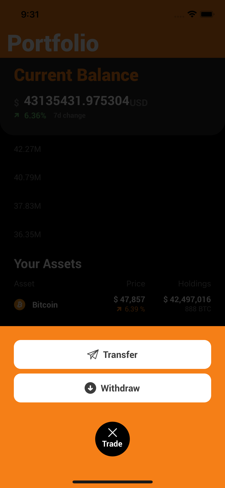

# coingecko api + React Native app

Using [coingecko](https://www.coingecko.com/en) as an api with [React Native](https://facebook.github.io/react-native/).

I have done this application for a personal project and wanted to try an improve my development skills when it comes to react ecosystem and to be more familiar and comfortable witha tech that I am already familiar with.
This app is made to be simple and may help people knowing React & Redux to get into creating mobile apps.

It's made with [coingecko](https://www.coingecko.com/en) as an api with [React Native](https://facebook.github.io/react-native/), coupled with Redux [Redux](https://react-redux.js.org/), [Navigation5(https://reactnavigation.org/)], dataflow and UI elements.

#### Idea inspiration

The UI is inspired by cryptoWaller, https://dribbble.com/shots/10834217-Crypto-Wallet

#### Main technologies used

- [React Native](https://github.com/facebook/react-native)

> A framework for building native apps with React.

- [Redux](http://redux.js.org/)

> Redux is a predictable state container for JavaScript apps.

> Backend api

- [coingecko](https://www.coingecko.com/en))

> React Native Navigation API

##### Installation

```
$ npm install
or
$ yarn
```

##### Then to run for iOS

```
$ cd ios && pod install
$ npx react-native link
$ react-native run-ios
```

##### For Android

```
$ react-native run-android
```

#### App structure

```
/src
  --/components
        BalanceInfo.js
        Chart.js
        HeaderBar.js
        IconTextButton.js
        index.js
        TabIcon.js
        TextButton.js
  --/constans
        constants.js
        dummy.js
        icons.js
        index.js
        theme.js
  --/hooks
     useRedux.js
  --/navigation
     tabs.js
  --/redux
     actions
     reducers
     store.js
  --/screens
      Home.js
      index.js
      MainLayout.js
      Market.js
      Portfolio.js
      Profile.js
 App.js

```

##### Todos and things that can be added

```
$ addings authentication to node.js and get an actual user profile
$ add App appearances (white mode)
$ add language support
$ handle account settings (password change)
$ react-native run-ios

```

##### Screenshots

<p align="center">
  
  
  
  
  
</p>
